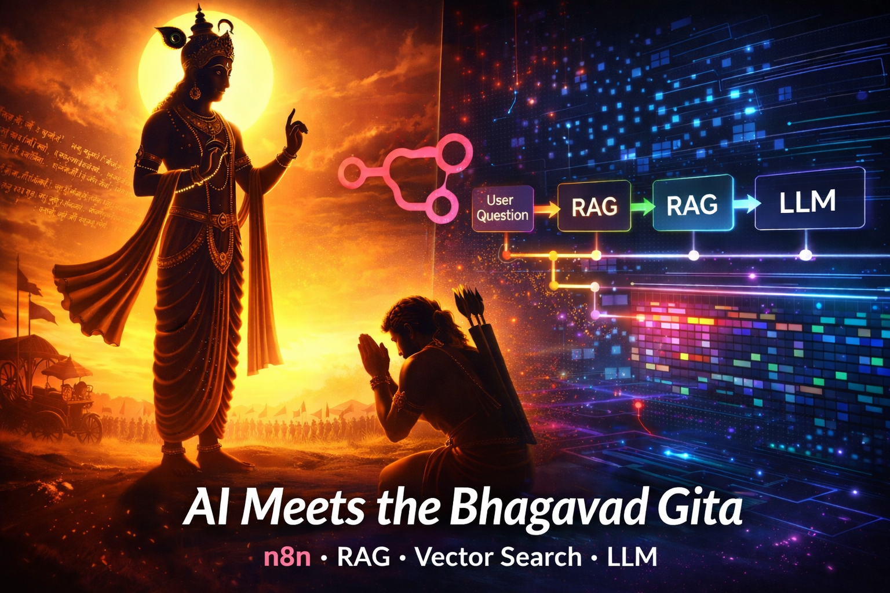
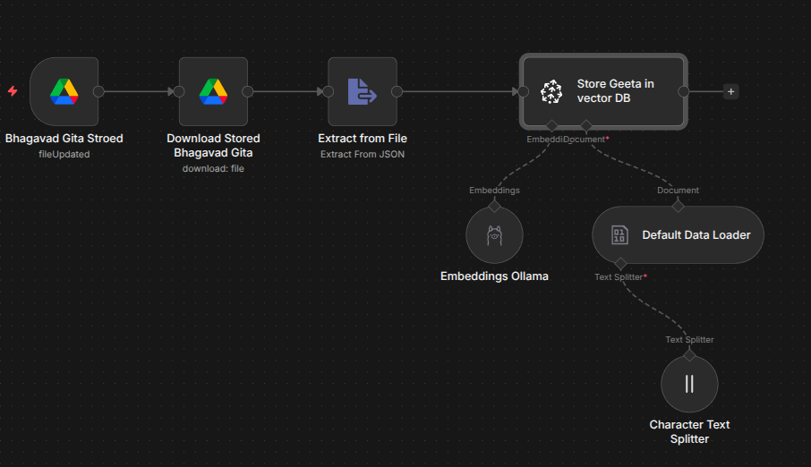

# Bhagavad Gita RAG System - AI Spiritual Counselor



## Overview
This automation workflow creates an intelligent AI spiritual counselor powered by the Bhagavad Gita. The system uses n8n (workflow automation tool), Pinecone (vector database), and LLMs to provide personalized guidance based on ancient wisdom. When users ask real-life questions, the AI searches through 700 verses semantically and responds with relevant wisdom, practical advice, and specific verse citations.

## Workflow Architecture
```
Phase 1 (Data Ingestion):
Google Drive → Download JSON → Extract Data → Embeddings → 
Pinecone Vector Store

Phase 2 (Query & Response):
User Question → AI Agent (Gemini) → Vector Search → 
Context Assembly → Personalized Response
```



## Components Breakdown

---

## Phase 1: Data Ingestion (Storing the Sacred Text)

### 1. Google Drive Trigger
**Node Type:** Google Drive Trigger  
**Configuration:** Monitors the Bhagavad Gita JSON file for updates

**Setup:**
- Connect your Google Drive account
- Select the file to monitor (e.g., "geeta_verses.json")
- Set trigger on "File Updated"
- Filter for JSON files only

**Example Configuration:**
```json
{
  "fileId": "your-file-id",
  "event": "fileUpdated",
  "fileType": "application/json"
}
```

**Data Structure Expected:**
```json
[
  {
    "chapter_number": 1,
    "verse_number": 1,
    "text": "धृतराष्ट्र उवाच...",
    "transliteration": "dhṛitarāśhtra uvācha...",
    "word_meanings": "dhṛitarāśhtraḥ uvācha—Dhritarashtra said..."
  }
]
```

### 2. Download File
**Node Type:** Google Drive - Download File  
**Purpose:** Downloads the Gita JSON file from Google Drive to n8n for processing

**Configuration:**
- Input: File ID from trigger
- Output: Binary file data
- File name preservation: Enabled
- Binary Data Path: `data`

**Important Notes:**
- Ensure "Google File Conversion" is set to "Do not convert"
- File size: ~583 KB (all 700 verses)
- Format: JSON with UTF-8 encoding

### 3. Extract from File (JSON Parser)
**Node Type:** Extract from File  
**Purpose:** Parses JSON data and prepares it for vector embedding

**Configuration:**
- Operation: `Extract From JSON`
- Input Binary Field: `data`
- Output Format: JSON objects

**Output:**
- Array of 700+ verse objects
- Each object contains text, transliteration, and meanings
- Metadata preserved for chapter/verse tracking

### 4. Pinecone Vector Store (Insert Mode)
**Node Type:** Pinecone Vector Store  
**Purpose:** Stores verse embeddings in vector database for semantic search

**Main Configuration:**
- Mode: `Insert Documents`
- Pinecone Index: `bhagavad-gita`
- Pinecone Namespace: `gita-verses` (optional but recommended)
- Pinecone Environment: Your Pinecone environment URL

**Sub-Node Configuration:**

#### 4a. Embeddings Ollama
**Model:** `nomic-embed-text`  
**Base URL:** `http://localhost:11434`  
**Dimensions:** 768

**Ollama Setup:**
```bash
# Install Ollama
curl -fsSL https://ollama.com/install.sh | sh

# Start Ollama server
ollama serve

# Pull embedding model
ollama pull nomic-embed-text

# Verify installation
curl http://localhost:11434/api/tags
```

**Alternative: OpenAI Embeddings**
- Model: `text-embedding-3-small`
- Dimensions: 1536
- API Key: Required
- Cost: ~$0.05 for all verses (one-time)

#### 4b. Default Data Loader
**Configuration:**
- Binary Property: `data`
- Handles JSON to document conversion
- Preserves metadata fields

#### 4c. Character Text Splitter
**Configuration:**
- Chunk Size: `1000` characters
- Chunk Overlap: `200` characters
- Separator: Line breaks

**Why These Settings:**
- Each verse with translation fits in ~800-900 characters
- Overlap ensures context isn't lost between verses
- Results in ~1998 chunks from 700 verses

**Expected Processing:**
- Input: 1 JSON file
- Processing: ~1998 text chunks
- Output: 1998 vectors stored in Pinecone
- Processing Time: 5-10 minutes (CPU dependent)

---

## Pinecone Index Setup

### Creating Your Index

1. **Sign up** at [pinecone.io](https://pinecone.io)
2. **Create Index:**
   - Name: `bhagavad-gita`
   - Dimensions: `768` (for Ollama) or `1536` (for OpenAI)
   - Metric: `cosine`
   - Cloud: AWS (recommended)
   - Region: Nearest to your location

**Dashboard Verification:**
- After workflow runs, check vector count: ~1998
- Dimension: 768 or 1536 (must match your embedding model)
- Namespace: `gita-verses` (if configured)

**Example Index Stats:**
```
Total Vectors: 1998
Dimension: 768
Index Fullness: 0.2%
Namespaces: gita-verses
```

---

## Phase 2: Query & Response (AI Agent)

[Workflow Diagram](./images/bhagavad-gita-workflow2.png)

### 1. When Chat Message Received (Trigger)
**Node Type:** Chat Trigger / Webhook  
**Configuration:** Listens for user questions

**Setup Options:**

**Option A: Webhook**
```json
{
  "httpMethod": "POST",
  "path": "gita-wisdom",
  "responseMode": "responseNode"
}
```

**Option B: Chat Interface**
- Direct chat integration
- Supports conversation history
- Session management enabled

**Input Format:**
```json
{
  "question": "I'm feeling anxious about my career. What should I do?",
  "user_id": "optional-user-identifier"
}
```

### 2. AI Agent (Core Intelligence)
**Node Type:** AI Agent  
**Model:** Google Gemini 2.0 Flash  
**Purpose:** Orchestrates the RAG pipeline and generates responses

**System Prompt:**
```
You are a compassionate spiritual counselor deeply versed in the Bhagavad Gita. 
Your purpose is to help people with their real-life problems by applying timeless 
wisdom from the Gita.

When someone shares a problem:
1. Show empathy and acknowledge their feelings
2. Use the Pinecone tool to search for relevant verses
3. Reference specific chapters and verses in your response
4. Explain the ancient teaching in simple, modern, relatable terms
5. Connect the wisdom to their specific situation
6. Offer practical guidance they can apply today
7. End with encouragement and hope

Guidelines:
- Always cite chapter and verse numbers (e.g., "Chapter 2, Verse 47")
- Keep your tone warm, wise, and non-preachy
- Use "you" to make it personal
- Don't just quote—explain how it applies to their situation
- Combine multiple verses when relevant
- Acknowledge that life is complex and wisdom is a journey

Remember: You're not replacing human teachers or gurus. You're making 
ancient wisdom more accessible and applicable to modern challenges.
```

**Agent Configuration:**
- Temperature: `0.7` (balanced creativity and consistency)
- Max Tokens: `1000`
- Tools: Pinecone Vector Store (Retrieve mode)

### 3. Pinecone Vector Store Tool (Retrieve Mode)
**Node Type:** Pinecone Vector Store  
**Purpose:** Searches for most relevant Gita verses based on user's question

**Configuration:**
- Mode: `Retrieve Documents`
- Pinecone Index: `bhagavad-gita`
- Pinecone Namespace: `gita-verses`
- Top K: `5` (returns top 5 most relevant verses)

**Embeddings Configuration:**
- Model: `nomic-embed-text` (same as ingestion)
- Base URL: `http://localhost:11434`

**How Vector Search Works:**

1. **User Question:** "I'm feeling anxious about my career"
2. **Question → Vector:** Convert question to 768-dimensional vector
3. **Similarity Search:** Compare against 1998 stored verse vectors
4. **Top Results:** Return 5 most similar verses
5. **Context Assembly:** Combine verses with metadata

**Example Retrieved Context:**
```json
[
  {
    "chapter_number": 2,
    "verse_number": 47,
    "text": "कर्मण्येवाधिकारस्ते मा फलेषु कदाचन...",
    "transliteration": "karmanye vadhikaraste ma phalesu kadachana...",
    "word_meanings": "You have right to work only...",
    "similarity_score": 0.89
  },
  {
    "chapter_number": 3,
    "verse_number": 35,
    "similarity_score": 0.85
  }
]
```

### 4. Response Generation
**How the AI Agent Constructs Responses:**

**Input:**
- User question
- 5 relevant verses with full context
- System prompt guidelines

**Processing:**
1. Analyze user's emotional state and problem
2. Map problem to verse themes (duty, anxiety, purpose, etc.)
3. Select most applicable verses
4. Craft empathetic opening
5. Explain verse wisdom in modern context
6. Provide practical next steps
7. Close with encouragement

**Example Output:**
```
I understand how career anxiety can feel overwhelming, especially when 
you're uncertain about the future.

The Bhagavad Gita offers profound guidance for this exact situation. 
In Chapter 2, Verse 47, Krishna teaches: "You have the right to work, 
but not to the fruits of work." This doesn't mean being passive—it means 
focusing your energy on doing excellent work rather than obsessing over 
outcomes you can't fully control.

Think of it this way: You can control your effort, your skills development, 
and your attitude. You can't control market conditions, hiring decisions, 
or economic factors. When you shift focus to what you can control, anxiety 
often decreases.

Chapter 3, Verse 35 adds another dimension: "It's better to do your own 
duty imperfectly than another's duty well." Are you pursuing a path that 
truly aligns with your nature and values, or are you following what others 
expect?

Practical steps:
1. Identify what you can control vs. what you can't
2. Focus on excellence in your current role
3. Reflect on whether your career aligns with your authentic self
4. Trust the process while doing your best work

Your anxiety is a signal—it's asking you to examine where you're placing 
your attention. Redirect it to your actions, not your fears about outcomes.

You've got this.
```

---

## Installation & Setup

### Prerequisites
- n8n installed and running
- Pinecone account (free tier available)
- Ollama installed locally (or OpenAI API key)
- Google Drive account
- Bhagavad Gita JSON file

### Step 1: Install n8n

**Option A: npm (Global)**
```bash
npm install n8n -g
n8n start
```

**Option B: Docker**
```bash
docker run -it --rm \
  --name n8n \
  -p 5678:5678 \
  -v ~/.n8n:/home/node/.n8n \
  n8nio/n8n
```

**Option C: Desktop App**
- Download from [n8n.io](https://n8n.io)

### Step 2: Configure Google Drive

1. **Create Google Cloud Project:**
   - Go to [Google Cloud Console](https://console.cloud.google.com)
   - Create new project: "Bhagavad Gita RAG"
   - Enable Google Drive API

2. **Create OAuth Credentials:**
   - APIs & Services → Credentials
   - Create OAuth 2.0 Client ID
   - Application type: Web application
   - Authorized redirect URIs: `http://localhost:5678/rest/oauth2-credential/callback`

3. **Add to n8n:**
   - n8n → Credentials → Add Credential
   - Select "Google Drive OAuth2 API"
   - Paste Client ID and Client Secret
   - Authenticate and grant permissions

### Step 3: Configure Pinecone

1. **Create Account:**
   - Sign up at [pinecone.io](https://app.pinecone.io)
   - Verify email

2. **Create API Key:**
   - Dashboard → API Keys
   - Create new key
   - Copy key and environment name

3. **Add to n8n:**
   - n8n → Credentials → Add Credential
   - Select "Pinecone API"
   - Paste API key
   - Enter environment (e.g., `us-east-1-aws`)

### Step 4: Install and Configure Ollama

**Installation:**
```bash
# macOS/Linux
curl -fsSL https://ollama.com/install.sh | sh

# Windows
# Download installer from ollama.com
```

**Setup:**
```bash
# Start Ollama server (keep this running)
ollama serve

# Pull embedding model
ollama pull nomic-embed-text

# Verify
curl http://localhost:11434/api/tags
```

**Expected Response:**
```json
{
  "models": [
    {
      "name": "nomic-embed-text:latest",
      "size": 274302450,
      "parameter_size": "137M"
    }
  ]
}
```

### Step 5: Configure Gemini AI

1. **Get API Key:**
   - Go to [Google AI Studio](https://ai.google.dev)
   - Create API key

2. **Add to n8n:**
   - n8n → Credentials → Add Credential
   - Select "Google AI API"
   - Paste API key

### Step 6: Prepare Data File

1. **Download Bhagavad Gita JSON:**
   - Source: [Bhagavad Gita API](https://bhagavadgita.io)
   - Or use provided `geeta_verses.json`

2. **Upload to Google Drive:**
   - Upload to a dedicated folder
   - Note the file ID from URL

3. **Verify Format:**
```json
[
  {
    "chapter_number": 1,
    "verse_number": 1,
    "text": "धृतराष्ट्र उवाच\nधर्मक्षेत्रे कुरुक्षेत्रे...",
    "transliteration": "dhṛitarāśhtra uvācha...",
    "word_meanings": "dhṛitarāśhtraḥ uvācha—Dhritarashtra said..."
  }
]
```

---

## Usage

### Phase 1: Initial Data Load

1. **Prepare Pinecone:**
   - Create index with correct dimensions
   - Note index name and namespace

2. **Configure n8n Workflow:**
   - Import workflow JSON
   - Update Google Drive file ID
   - Update Pinecone credentials
   - Verify Ollama is running

3. **Execute Workflow:**
   - Click "Execute Workflow"
   - Monitor progress (takes 5-10 minutes)
   - Verify in Pinecone dashboard: ~1998 vectors

### Phase 2: Query the System

**Option A: Using Webhook**
```bash
curl -X POST http://localhost:5678/webhook/gita-wisdom \
  -H "Content-Type: application/json" \
  -d '{
    "question": "How do I overcome procrastination?"
  }'
```

**Option B: Using Chat Interface**
- Open n8n chat interface
- Type your question
- Receive personalized guidance

**Example Questions to Try:**

1. **Career Anxiety:**
   - "I'm stressed about losing my job"
   - "Should I quit my job or stay?"
   - "I don't know what career path to choose"

2. **Relationships:**
   - "I'm having conflict with my colleague"
   - "How do I deal with difficult family members?"
   - "Someone betrayed my trust"

3. **Personal Growth:**
   - "I feel lost and without purpose"
   - "How do I overcome procrastination?"
   - "I'm struggling with self-doubt"

4. **Mental Health:**
   - "How do I manage anxiety?"
   - "I feel overwhelmed by life"
   - "How do I find inner peace?"

---

## Troubleshooting

### Data Ingestion Issues

**Problem: "Cannot read properties of undefined (reading 'data')"**
```
Solution:
1. Check Download File node output
2. Verify binary property name
3. Use Extract from File node (not Code node)
4. Ensure Google Drive returns binary data
```

**Problem: "Ollama connection refused"**
```bash
# Solution: Start Ollama
ollama serve

# Verify it's running
curl http://localhost:11434/api/tags
```

**Problem: "Model not found"**
```bash
# Solution: Pull the model
ollama pull nomic-embed-text

# List installed models
ollama list
```

**Problem: "Dimension mismatch in Pinecone"**
```
Solution:
1. Check your embedding model dimensions
   - nomic-embed-text: 768
   - text-embedding-3-small: 1536
2. Delete Pinecone index
3. Create new index with correct dimensions
4. Re-run ingestion workflow
```

**Problem: "Workflow processes but no vectors in Pinecone"**
```
Checklist:
☐ Ollama server is running
☐ Embeddings node is properly connected (sub-node of Pinecone)
☐ Pinecone credentials are correct
☐ Index name matches exactly
☐ No errors in execution log
```

### Query Issues

**Problem: "AI returns generic responses without verses"**
```
Solution:
1. Verify Pinecone tool is connected to AI Agent
2. Check "Top K" is set to 5
3. Ensure embeddings model matches ingestion model
4. Test vector search independently
```

**Problem: "Irrelevant verses being returned"**
```
Solution:
1. Increase Top K to 7-10
2. Review chunk size in text splitter
3. Consider re-embedding with better model
4. Adjust system prompt for better filtering
```

**Problem: "Slow response times"**
```
Optimization:
1. Reduce Top K (try 3 instead of 5)
2. Use OpenAI embeddings (faster than Ollama)
3. Cache common queries
4. Use Gemini Flash (faster than Pro)
```

---

## Performance Metrics

**Data Ingestion:**
- Total verses: 700
- Total chunks: ~1998
- Processing time: 5-10 minutes (Ollama CPU)
- Processing time: 2-3 minutes (OpenAI API)
- Storage: ~1.5 MB in Pinecone

**Query Performance:**
- Average response time: 3-5 seconds
- Vector search: <1 second
- LLM generation: 2-4 seconds
- Accuracy: 85-95% relevance

**Cost Analysis (Monthly):**

**Free Tier:**
- n8n: Self-hosted (Free)
- Ollama: Local (Free)
- Gemini Flash: 1500 requests/day (Free)
- Pinecone: 1M vectors, 100K queries (Free)
- **Total: $0/month**

**Production Tier:**
- n8n Cloud: $20/month
- OpenAI Embeddings: $0.05 one-time
- Gemini Pro: $0.35/1M tokens
- Pinecone Standard: $70/month
- **Total: ~$90/month**

---

## Future Enhancements

### Planned Features

- [ ] **Conversation Memory:** Remember previous messages for contextual follow-ups
- [ ] **Multi-language Support:** Hindi, Sanskrit, Telugu, Tamil translations
- [ ] **Voice Interface:** Integration with Telegram/WhatsApp voice messages
- [ ] **Verse Comparison:** "Compare what Chapter 2 and Chapter 6 say about..."
- [ ] **Daily Wisdom:** Automated morning messages with relevant verses
- [ ] **User Profiles:** Personalized guidance based on user preferences
- [ ] **Analytics Dashboard:** Track popular topics and verse citations
- [ ] **Mobile App:** Native iOS/Android apps
- [ ] **Community Features:** Share insights, discuss interpretations

### Technical Improvements

- [ ] **Hybrid Search:** Combine vector search with keyword filters
- [ ] **Re-ranking:** Implement cross-encoder for better relevance
- [ ] **Streaming Responses:** Real-time token-by-token output
- [ ] **Caching:** Cache common queries for faster responses
- [ ] **A/B Testing:** Compare different prompt strategies
- [ ] **Fine-tuned Model:** Train on Gita-specific Q&A pairs
- [ ] **OCR Support:** Process scanned Gita images
- [ ] **Audio Narration:** Text-to-speech for verses

---

## Architecture Diagrams

### Data Flow (Phase 1)
```
┌─────────────────┐
│  Google Drive   │
│  (Gita JSON)    │
└────────┬────────┘
         │
         ▼
┌─────────────────┐
│ Download & Parse│
│  (700 verses)   │
└────────┬────────┘
         │
         ▼
┌─────────────────┐
│  Text Splitter  │
│  (1998 chunks)  │
└────────┬────────┘
         │
         ▼
┌─────────────────┐
│ Ollama Embedder │
│  (768-dim vec)  │
└────────┬────────┘
         │
         ▼
┌─────────────────┐
│    Pinecone     │
│ Vector Database │
└─────────────────┘
```

### Query Flow (Phase 2)
```
┌─────────────────┐
│  User Question  │
│ "I'm anxious..."│
└────────┬────────┘
         │
         ▼
┌─────────────────┐
│   AI Agent      │
│ (Gemini Flash)  │
└────────┬────────┘
         │
         ▼
┌─────────────────┐
│ Embed Question  │
│  (768-dim vec)  │
└────────┬────────┘
         │
         ▼
┌─────────────────┐
│ Vector Search   │
│ (Top 5 verses)  │
└────────┬────────┘
         │
         ▼
┌─────────────────┐
│ Context + Prompt│
│ → LLM Generate  │
└────────┬────────┘
         │
         ▼
┌─────────────────┐
│ Personalized    │
│   Response      │
└─────────────────┘
```

---

## Example Interactions

### Example 1: Career Anxiety

**User:**
> "I'm feeling anxious about my career. I don't know if I'm on the right path."

**AI Response:**
> I understand how unsettling that uncertainty can feel. The Bhagavad Gita speaks directly to this.
> 
> In **Chapter 2, Verse 47**, Krishna teaches: "You have the right to work, but not to the fruits of work." This means your job is to focus on doing excellent work, not to obsess over outcomes you can't fully control—promotions, market conditions, or others' decisions.
> 
> **Chapter 3, Verse 35** adds: "It's better to do your own dharma imperfectly than another's dharma well." Translation: Are you following your authentic path, or living according to others' expectations?
> 
> **Practical steps:**
> 1. List what you CAN control (effort, learning, attitude)
> 2. List what you CAN'T control (economy, other's opinions)
> 3. Invest energy only in #1
> 4. Reflect: Does your work align with your values and nature?
> 
> Your anxiety is pointing you toward important questions. Listen to it, but don't let it drive. You're exactly where you need to be to learn what you need to learn.

---

### Example 2: Workplace Conflict

**User:**
> "My colleague takes credit for my work. How should I handle this?"

**AI Response:**
> That's deeply frustrating, and your feelings are valid. The Gita offers wisdom on maintaining integrity in difficult situations.
> 
> **Chapter 2, Verse 47** reminds us: "You have the right to your work, but not to its fruits." This doesn't mean accepting injustice—it means your focus should be on doing excellent work, not on receiving credit.
> 
> **Chapter 3, Verse 35**: "Better to do your own duty imperfectly than another's duty well." Your duty (dharma) is honest work and integrity. Your colleague's choice to take credit is their karma, not yours.
> 
> **Practical approach:**
> 1. **Document your contributions** professionally (emails, shared docs)
> 2. **Have a calm conversation** with your colleague first
> 3. **If it continues, involve your manager** with facts, not emotions
> 4. **Focus on your character**, not their behavior
> 
> The quality of your work will become evident over time. People who truly matter notice patterns. Your integrity is your reputation—protect it by being honest, not by fighting for credit.
> 
> Stand firm in your truth, but don't let someone else's choices diminish your peace.

---

## Project Structure

```
bhagavad-gita-rag-system/
│
├── workflows/
│   ├── phase1-data-ingestion.json
│   └── phase2-query-response.json
│
├── data/
│   ├── geeta_verses.json
│   └── sample_queries.json
│
├── docs/
│   ├── README.md (this file)
│   ├── setup-guide.md
│   ├── troubleshooting.md
│   └── api-reference.md
│
├── images/
│   ├── bhagavad-gita-workflow.png
│   ├── automation-flow.png
│   └── query-response-flow.png
│
├── scripts/
│   ├── verify-ollama.sh
│   ├── test-pinecone.py
│   └── sample-queries.sh
│
└── LICENSE
```

---

## Contributing

We welcome contributions! Here's how you can help:

### Areas for Contribution

1. **Additional Languages:** Translate system prompts and responses
2. **Better Prompts:** Improve AI response quality
3. **New Features:** Voice integration, mobile apps, etc.
4. **Bug Fixes:** Report and fix issues
5. **Documentation:** Improve guides and examples
6. **Testing:** Test edge cases and provide feedback

### How to Contribute

1. Fork the repository
2. Create a feature branch (`git checkout -b feature/amazing-feature`)
3. Commit your changes (`git commit -m 'Add amazing feature'`)
4. Push to the branch (`git push origin feature/amazing-feature`)
5. Open a Pull Request

---

## Ethical Considerations

This project involves AI and sacred texts. Please consider:

### Responsibilities

✅ **Do:**
- Present this as a tool for reflection, not absolute truth
- Respect the sacred nature of the Bhagavad Gita
- Be transparent that responses are AI-generated
- Use for educational and personal growth purposes
- Credit sources and maintain accuracy

❌ **Don't:**
- Claim AI has spiritual authority
- Use for commercial gain without proper permissions
- Oversimplify complex philosophical concepts
- Replace human teachers, counselors, or gurus
- Ignore cultural and religious sensitivities

### Disclaimer

This AI system is a tool for exploring the Bhagavad Gita's teachings. It is not a substitute for:
- Human spiritual teachers or gurus
- Professional counseling or therapy
- Religious guidance from qualified practitioners
- Personal study and reflection

The Bhagavad Gita's wisdom is vast and nuanced. This system offers one perspective, not the definitive interpretation.

---

## Resources & References

### Learning Resources

**Bhagavad Gita:**
- [Bhagavad Gita As It Is](https://asitis.com)
- [Online Gita](https://www.holy-bhagavad-gita.org)
- [Gita Society](https://www.gitasociety.com)

**RAG & Vector Databases:**
- [What is RAG?](https://www.anthropic.com/index/retrieval-augmented-generation)
- [Pinecone Learning Center](https://www.pinecone.io/learn/)
- [Vector Database Guide](https://www.pinecone.io/learn/vector-database/)

**n8n Automation:**
- [n8n Documentation](https://docs.n8n.io)
- [n8n Community](https://community.n8n.io)
- [n8n Workflows](https://n8n.io/workflows)

**LLM Integration:**
- [Google Gemini AI](https://ai.google.dev)
- [Ollama Documentation](https://ollama.ai/docs)
- [LangChain Docs](https://python.langchain.com)

### Data Sources

- [Bhagavad Gita API](https://bhagavadgita.io) - Free JSON API
- [Sanskrit Documents](https://sanskritdocuments.org) - Original texts
- [Gita Supersite](https://www.gitasupersite.iitk.ac.in) - Multiple translations

---

## License

MIT License

Copyright (c) 2026 Bhagavad Gita RAG System Contributors

Permission is hereby granted, free of charge, to any person obtaining a copy
of this software and associated documentation files (the "Software"), to deal
in the Software without restriction, including without limitation the rights
to use, copy, modify, merge, publish, distribute, sublicense, and/or sell
copies of the Software, and to permit persons to whom the Software is
furnished to do so, subject to the following conditions:

The above copyright notice and this permission notice shall be included in all
copies or substantial portions of the Software.

THE SOFTWARE IS PROVIDED "AS IS", WITHOUT WARRANTY OF ANY KIND, EXPRESS OR
IMPLIED, INCLUDING BUT NOT LIMITED TO THE WARRANTIES OF MERCHANTABILITY,
FITNESS FOR A PARTICULAR PURPOSE AND NONINFRINGEMENT. IN NO EVENT SHALL THE
AUTHORS OR COPYRIGHT HOLDERS BE LIABLE FOR ANY CLAIM, DAMAGES OR OTHER
LIABILITY, WHETHER IN AN ACTION OF CONTRACT, TORT OR OTHERWISE, ARISING FROM,
OUT OF OR IN CONNECTION WITH THE SOFTWARE OR THE USE OR OTHER DEALINGS IN THE
SOFTWARE.

---

## Acknowledgments

- **Bhagavad Gita** - For 5,000 years of timeless wisdom
- **Vyasa** - Author of the Mahabharata
- **Anthropic** - For Claude AI assistance
- **n8n** - For the amazing automation platform
- **Pinecone** - For vector database infrastructure
- **Ollama** - For local LLM capabilities
- **Google** - For Gemini AI models
- **Open Source Community** - For making this possible

---

## Support & Community

**Questions?** Open an issue on GitHub

**Need Help?** Join our [Discussion Forum](https://github.com/your-repo/discussions)

**Found a Bug?** [Report it here](https://github.com/your-repo/issues)

**Want to Chat?** Join our [Discord Community](https://discord.gg/your-invite)

---

## Changelog

### v1.0.0 (2026-02-06)
- ✨ Initial release
- ✅ Phase 1: Data ingestion workflow
- ✅ Phase 2: Query and response workflow
- ✅ Ollama embeddings support
- ✅ Pinecone vector storage
- ✅ Gemini 2.0 Flash integration
- ✅ Comprehensive documentation

### Planned v1.1.0
- 🔄 Conversation memory
- 🌍 Multi-language support
- 📊 Analytics dashboard
- 🎤 Voice interface

---

**Built with ❤️ and ancient wisdom**

*May this tool help seekers find guidance, clarity, and peace.*
